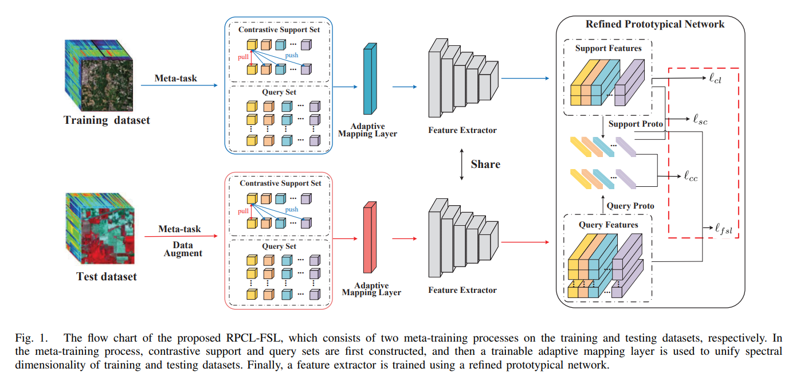

 # Refined Prototypical Contrastive Learning for Few-Shot Hyperspectral Image Classification
 # The source of paper : [https://ieeexplore.ieee.org/document/10070826]

## Description

The RPCL method incorporates supervised contrastive learning and FSL into an end-to-end network to perform small-sample HSI classification. To stabilize and refine the prototypes, RPCL-FSL imposes triple constraints on prototypes of the support set.


##Model




## Prerequisites

- [Anaconda 3]
- [Pytorch 1.7]
- [CUDA 10.1]
- [sklearn 0.23.2]


## dataset

1. target domain data set:

You can download the hyperspectral datasets in mat format at: http://www.ehu.eus/ccwintco/index.php/Hyperspectral_Remote_Sensing_Scenes, and move the files to `./datasets` folder.

2. source domain data set:

The source domain  hyperspectral datasets (Chikusei) in mat format is available in:http://park.itc.utokyo.ac.jp/sal/hyperdata.
You can download the preprocessed source domain data set (Chikusei_imdb_128.pickle) directly in pickle format, which is available in "link：https://pan.baidu.com/s/1JrCWJLmPFccfOrSh3P5QEA password：rnjv " , and move the files to `./datasets` folder.

An example dataset folder has the following structure:
```
datasets
├── Chikusei_imdb_128.pickle
├── IP
│   ├── indian_pines_corrected.mat
│   ├── indian_pines_gt.mat
├── salinas
│   ├── salinas_corrected.mat
│   └── salinas_gt.mat
└── paviaU
    ├── paviaU_gt.mat
    └── paviaU.mat
```


## Usage:

Take RPCL method on the UP dataset as an example: 
1. Download the required data set and move to folder`./data`.
2. Install the requirements : conda env create -f environment.yml.
3. If you down the source domain data set (Chikusei) in mat format,you need to run the script `Chikusei_imdb_128.py` to generate preprocessed source domain data. 
4. Taking 5 labeled samples per class as an example, run `RPCL-UP.py` to train and test the model.


##Citation

lf you use RPCL code in your research, we would appreciate a citation to the original paper:

@ARTICLE{10070826,
  author={Liu, Quanyong and Peng, Jiangtao and Ning, Yujie and Chen, Na and Sun, Weiwei and Du, Qian and Zhou, Yicong},
  journal={IEEE Transactions on Geoscience and Remote Sensing}, 
  title={Refined Prototypical Contrastive Learning for Few-Shot Hyperspectral Image Classification}, 
  year={2023},
  volume={},
  number={},
  pages={1-1},
  doi={10.1109/TGRS.2023.3257341}}

##Contact
Quanyong Liu, 584298639@qq.com


